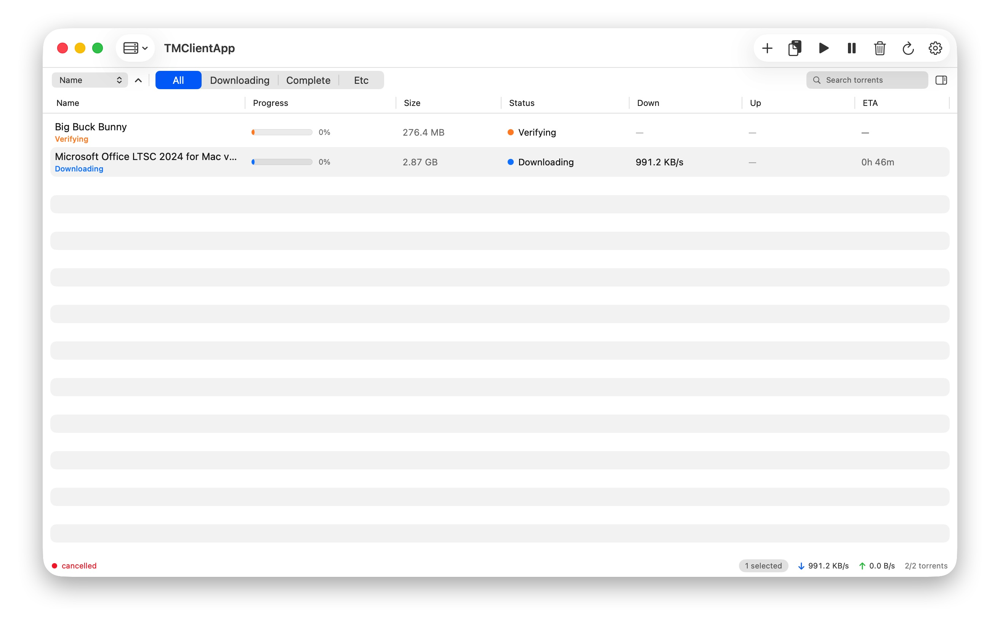
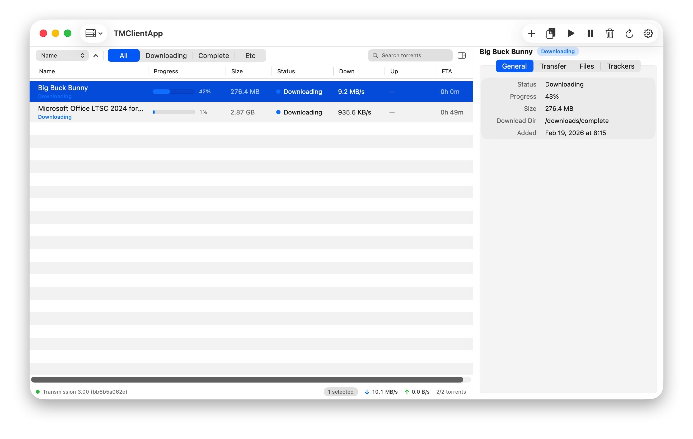

# TMClient macOS (SwiftUI)

A native macOS rewrite of [Transmission Remote GUI](https://github.com/transmission-remote-gui/transgui), built with Swift and SwiftUI. This project aims to provide a modern, performant, and native experience for managing Transmission torrents on macOS.

## 🚀 Features

- **Native macOS UI**: Built entirely with SwiftUI for a seamless macOS experience.
- **Comprehensive Torrent Management**:
  - List and monitor torrents with real-time status and progress.
  - Add torrents via URL or local `.torrent` files.
  - Actions: Start, stop, remove, verify, and reannounce.
  - Queue controls and priority management.
- **Advanced File Controls**: Select files to download and set their priority.
- **Tracker Management**: View and edit trackers for each torrent.
- **Session Preferences**:
  - Configure download directories and speed limits.
  - Manage queues and network settings (DHT, PEX, LPD).
- **Secure Storage**: RPC passwords are safely stored in the macOS Keychain.

## 📸 Screenshots

<p align="center">
  
  
</p>

## 🛠 Requirements

- **macOS**: 13.0 or later.
- **Xcode**: 15.0+ (or Swift 5.9 toolchain).
- **Transmission**: A running Transmission daemon with RPC enabled.

## 📦 Installation & Getting Started

### Download DMG (Recommended)
You can download the latest pre-built version from the **[Releases](https://github.com/K-Asimov/tm-client/releases)** page.
1. Go to the [Latest Release](https://github.com/K-Asimov/tm-client/releases/latest).
2. Download `TMClientApp.dmg`.
3. Open the `.dmg` file and drag **TMClientApp** to your **Applications** folder.

> **macOS Gatekeeper Warning**
>
> This app is not notarized by Apple, so macOS may block it from opening.
> If that happens, follow these steps:
>
> 1. Open **System Settings** > **Privacy & Security**.
> 2. Scroll down to the Security section and click **Open Anyway** next to the `"TMClientApp" was blocked` message.
> 3. Click **Open** in the confirmation dialog.
>
> *(You only need to do this once.)*

### Build from Source
#### Open in Xcode
1. Double-click `Package.swift` or open the root folder in Xcode.
2. Select the `TMClientApp` scheme.
3. Press `Cmd + R` to build and run.

### Run from Command Line
```bash
# Build and run using Swift Package Manager
swift run TMClientApp
```

## ⚙️ Configuration

Upon first launch, you can configure your connection in the Preferences:
- **Host**: The IP or hostname of your Transmission server.
- **Port**: Default is `9091`.
- **RPC Path**: Default is `/transmission/rpc`.
- **Authentication**: Optional username and password (stored securely in Keychain).

## 📄 License

This project is licensed under the [MIT License](LICENSE).
